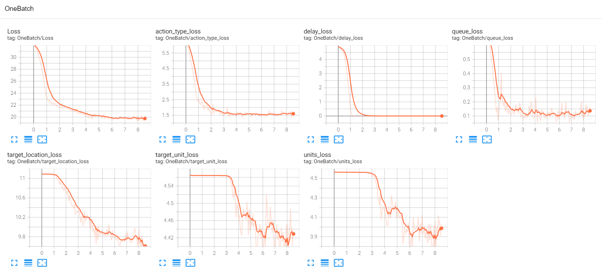

# mini-AlphaStar

## Introduction

We release mini-AlphaStar (mAS), which is a **mini-scale** version of the AlphaStar (AS) program. AS is the intelligent AI proposed by DeepMind to play StarCraft II (SC2). 

"mini-scale" means that we make the original AS's hyper-parameters **adjustable** so that mAS can be training and running on a **small** scale (e.g., in a single commercial server machine).

When designing the mAS, we referred to the "Occam's Razor Principle": **simple** is good. Therefore, we build mAS from scratch. Unless the function has a great impact on speed and performance, we shall omit it. 

Meanwhile, we also try not to use too many dependency packages, so that mAS should only depend on PyTorch. In this way, we simplify the learning cost of mAS and make the architecture of mAS relatively **easy** to read. 

The [Chinese](doc/README_CHS.MD) shows a simple readme in Chinese.

Below is mAS's trained performance on Simple64, by supervised learning on 50 replays of experts'.

<p float="left">
  
   
</p>

**Left:** At start of the game.                          **Right:** In the middle period.

<p float="left">
  
  
</p>

**Left:** Agent's 1st attack.                            **Right:** Agent's 2nd Attack.

## Update

This is the "v_1.05" version. In this one, we refactor most of the codes, making the performance has gained a big boost.
 
* We refactor most of the codes, from transforming replays to reinforcement learning;
* Through new architecture, the transformed replay tensor files have saved 70% disk space now;
* Memory usage is also optimized. Now the number of processing replays in SL is 3 times or more than before; 
* With the new tensor replay files, the training speed of SL is much faster, about 10x faster than before;
* Using weighted loss makes results of SL significantly increased. The accuracy of actions rises to above 90%;
* By a new SL training pattern, the accuracy of the action arguments like units improved from 0.05 to 0.95;
* The loss of RL calculations are refactored, making the readability improved;
* Due to the optimized algorithm, the sampling speed of RL is now 10x faster than before. 

## Hints

**Warning**: SC2 is extremely difficult and AlphaStar is also very complex. Even our project is a mini-AlphaStar, it has almost the similar technologies as AlphaStar, and the training resource also costs very high. It hardly can be trained on a single laptop or a home-used computer. The recommended way is to use a commercial server to train it. This server should also have a GPU card, along with enough large memory and disk space. For someone who is interesting in this project for the first time, we recommend you to collect (star) this project firstly, and devolve deeply into researching into it when you have training resources and enough free time.

## Location

The codes are stored in two places. 

Location | Usage
------------ | -------------
[Github](https://github.com/liuruoze/mini-AlphaStar) | for global users
[Gitee](https://gitee.com/liuruoze/mini-AlphaStar) | for users who are not fast to access Github easily in China

## Contents

The table below shows the corresponding packages in the project.

Packages | Content
------------ | -------------
alphastarmini.core.arch | deep neural architecture
alphastarmini.core.sl | supervised learning
alphastarmini.core.rl | reinforcement learning
alphastarmini.core.ma | multi-agent league traning
alphastarmini.lib | lib functions
alphastarmini.third | third party functions

## Requirements

PyTorch >= 1.5, others please see requirements.txt.

## Install

The [SCRIPT Guide](scripts/Setup_cmd.MD) gives some commands to install PyTorch by conda (this will automatically install CUDA and cudnn, which is convenient).

E.g., like:
```
conda create -n th_1_5 python=3.7 pytorch=1.5 -c pytorch
```
to install PyTorch 1.5 (with accompanied CUDA and cudnn).

Then you can install other python packages by pip, e.g., the command in the below line:
```
pip install -r requirements.txt
```

## Usage

After all requirements are done, run the below python file to run the program:
```
python run.py
```
to start the program (you may use comments and uncomments to select the training process you want).

The [USAGE Guide](doc/USAGE.MD) may provide some answers to problems and questions.

## Replays processing

In supervised learning, you need to first download many SC2 replays.

The [REPLAY Guide](doc/REPLAY.MD) shows a guide to download these SC2 replays.

The [ZHIHU Guide](https://zhuanlan.zhihu.com/p/410523216) provides Chinese users who are not convenient to use Battle.net (outside China) a guide to download replays.

After downloading replays, you should move the replays to "./data/Replays/filtered_replays_1" (the name can be changed if you modify `transform_replay_data.py`).

Then use `transform_replay_data.py` to transform these replays to pickles or tensors (the output type can be changed in the code of that file).

Pickles are Python pickle data that are not preprocessed. Tensors are PyTorch tensors that have been preprocessed.

## Multi-GPU training

This version starts to support multi-GPU supervised learning training for mAS, which can greatly improve the training speed. The way to use multi-GPU training is very straightforward, as follows:
```
python run_multi-gpu.py
```

(Currently, multi-GPU training for RL is still not supported)

Notice:

Multi-GPU training may have unstable factors (this is caused by the reason that PyTorch's support is not as stable as imagined). If you find that multi-GPU training has training instability and runtime errors, please switch back to single-GPU training.

Currently, we support four types of supervised training. They all reside in the package of "alphastarmini.core.sl".

File | Content
------------ | -------------
`sl_train_by_pickle.py` | pickle (data not preprocessed) training: Slow, but cost small disk space.
`sl_train_by_tensor.py` | tensor (data preprocessed)training: Fast, but cost huge disk space.
`sl_multi_gpu_by_pickle.py` | multi-GPU, pickle training: It has a requirement need for large shared memory.
`sl_multi_gpu_by_tensor.py` | multi-GPU, tensor training: It needs both for large memory and shared memory.

You can choose the suitable way you need to do training.

You can use the `load_pickle.py` to transform the generated pickles (in "./data/replay_data") to tensors (in "./data/replay_data_tensor").

## Results

Here are some illustration figures of SL training process below:



We can see the losses (one main loss and six argument losses of which the main loss consists) fall down quickly.

## History

The [HISTORY](doc/HISTORY.MD) is the history introduction of the previous versions of mAS.


## Citing

If you find our repository useful, please cite this project:
```
@misc{liu2021mAS,
  author = {Ruo{-}Ze Liu and Wenhai Wang and Yang Yu and Tong Lu},
  title = {mini-AlphaStar},
  year = {2021},
  publisher = {GitHub},
  journal = {GitHub repository},
  howpublished = {\url{https://github.com/liuruoze/mini-AlphaStar}},
}
```

## Report

The [An Introduction of mini-AlphaStar](https://arxiv.org/abs/2104.06890) is a technical report that introduces mAS.


## Rethinking

The [Rethinking of AlphaStar](https://arxiv.org/abs/2108.03452) gives some rethinking of AlphaStar.


## Paper

We will give a paper that may be available in the future presenting the experiments and evaluations on using mAS. 